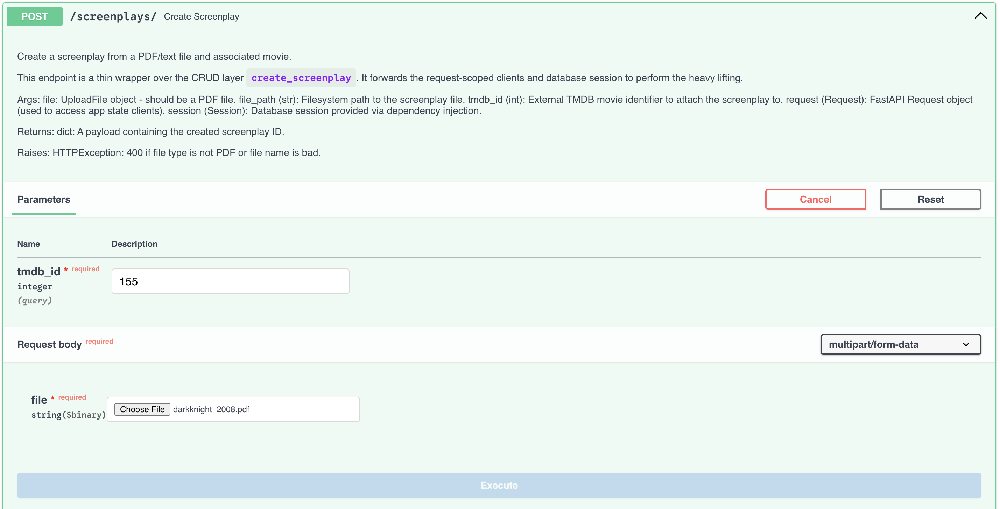
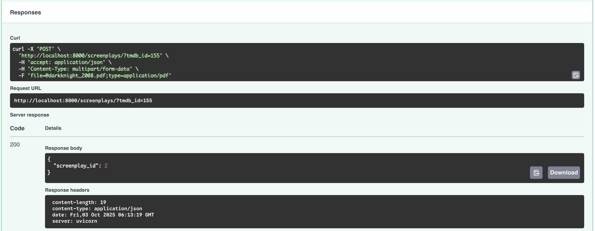
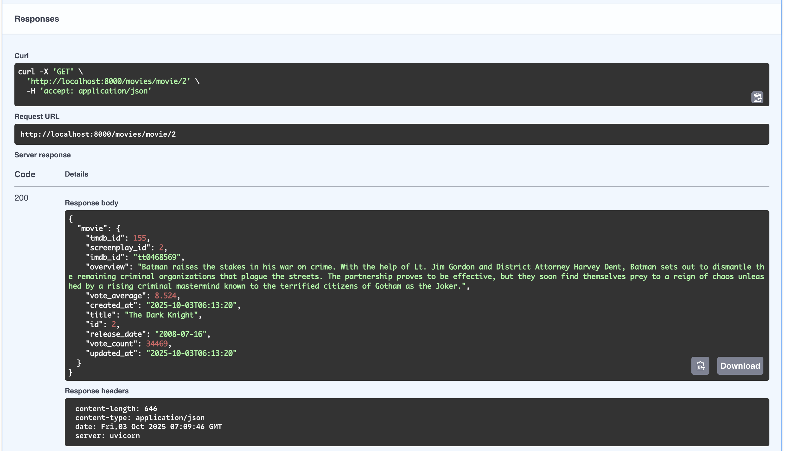
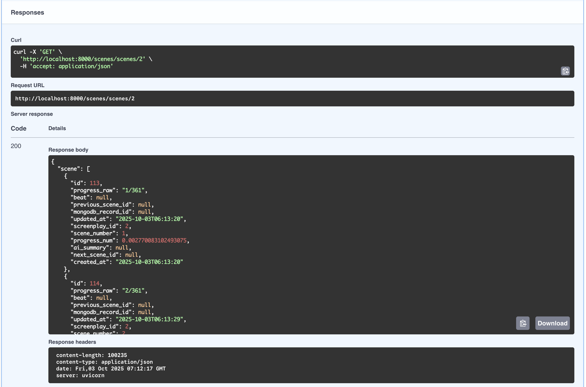

# Truby AI

Note: ⚠️ This application is under development.

Truby AI is your AI-assistant for writing better screenplays. If you want to flesh out your screenplay and have sample screenplays, then you can use Truby AI to provide you with screenwriting and storytelling tips!

## Tech Stack at a Glance

The tech stack for this application is as follows:
- **FastAPI** and **SQLModel** for the backend.
- Local **SQLite3**.
- **Pinecone** for the vector database.
- **MongoDB** for the document data store for the scenes we extract from the screenplay.
- **OpenAI** for the embeddings and LLM inference.
- **The Movie Database** as our gold source for movie data.
- Coming Soon: **MCP** to integrate with a foundational LLM of your choice.

## Getting Started

Once you've cloned the repo, initialize it using `uv init`.

### Important Environment Variables

This project will require a `.env` file with several variables. You may refer to the `.env.example` as it contains a description of each variable and its purpose. We produce it below for convenience:

- `OPENAI_API_KEY`: You'll need an OpenAI API key.
- `PINECONE_API_KEY`: Pinecone API key: you can get one for free + a free index.
- `PINECONE_HOST_URL`: Pinecone Host URL: you'll get one once you create a free index.
- `TMDB_READONLY_API_KEY`: The Movie Database read-only API key.
- `SQL_DB_PATH`: Location of your SQL database file. For this project, a local SQLite3 database is assumed.
- `MONGODB_CONNECTION`: MongoDB connection string.
- `MONGODB_DATABASE`: MongoDB database name.
- `STORAGE_DIR`: This is where your screenplays will be stored when you upload them through the `create_screenplay()` endpoint. 

### `.env` file

The first thing you'll need to do is fill out the environment variables in the `.env` file.
- OpenAI: You should get an API key from the [OpenAI Platform](https://platform.openai.com/docs/overview) site.
- Pinecone: Get an API key from [Pinecone](https://www.pinecone.io/) site. You can create an index for free, which'll then give you a host URL.
- The Movie Database: Get an API key [here](https://www.themoviedb.org/).
- SQL database path: We use a local SQLite3 database and so for this project, you need to put the path where your SQL database file (ends in `*.db`) lives.
- MongoDB: Create a free MongoDB cluster on [MongoDB Cloud](https://cloud.mongodb.com) or setup a local instance.

### Run requirements.txt

Run one of either from the project root.

- `uv pip install -r requirements.txt`
- `uv add -r requirements.txt`

### Run the app

You can run the app by going into the `app/` folder and running the following: `uvicorn main:app --reload`. You should be able to access the API by going to `http://localhost:8000/docs`.

### Update the `clause_desktop_config.json`

Note: ⚠️ You'll need Claude Desktop to interact with the MCP server.

You should navigate to the `claude_desktop_config.json` file:

- For Windows users, the file is located under "%APPDATA%\Claude\claude_desktop_config.json".
- For Mac users, the file is located under "~/Library/Application Support/Claude/claude_desktop_config.json".

Source: [Weavely.ai](https://www.weavely.ai/blog/claude-mcp)

Run `which mcp-proxy` to find out where `mcp-proxy` is on your machine. Paste that location into the JSON file:

```json
{
  "mcpServers": {
    "trubyai-mcp": {
      "command": "full/path/to/mcp-proxy",
      "args": [
        "http://localhost:8000/mcp"
      ]
    }
  }
}
```

### Upload a screenplay and wait for it to load

Assuming you've setup your clients for OpenAI, Pinecone, and MongoDB, you should be able to begin uploading screenplays and chunking them up into scenes.

Upload a screenplay using the `POST /screenplays/` endpoint. Once you do, you'll get a screenplay ID.

Note: The Movie Database (TMDB) ID is one you must know and provide. 

In the examples below, "The Dark Knight" (2008) has an ID of 155, as you can verify by checking the URL below:

[The Dark Knight](https://www.themoviedb.org/movie/155)

This trick works for most movies: simply look at the URL which is formatted as `https://www.themoviedb.org/movie/{movie_id}`.




Once successful, you can take a look at the respective `movie` and `scenes` records. For data integrity purposes, we restrict the `GET` requests to providing only the `screenplay_id`.

- `GET` movie endpoint: `/movies/movie/{screenplay_id}`



- `GET` scenes endpoint: `/scenes/scenes/{screenplay_id}`



### Try running it in Claude Desktop!

With your MCP server running and a few scenes now in your database, let's try running Claude Desktop with our MCP Server.

<video src="./docs/images/mcp_claude_desktop_sample.mp4" controls></video>
